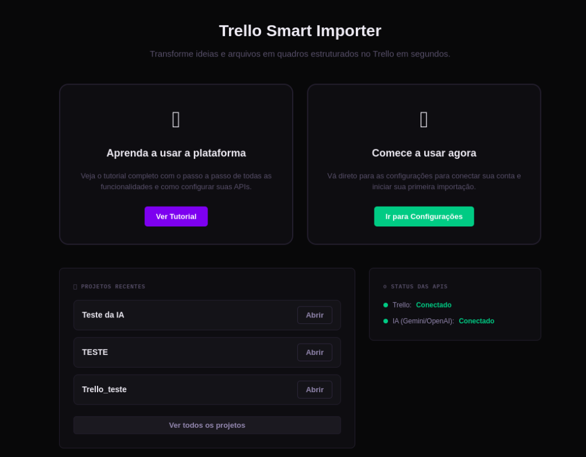

# Trello Smart Importer v2 — AI-Powered Task Importer

O **Trello Smart Importer v2** é uma aplicação desktop de alta performance projetada para automatizar a criação de fluxos de trabalho complexos no Trello. Ele utiliza Inteligência Artificial e processamento de dados estruturados para transformar descrições simples ou planilhas em quadros organizados com Sprints, tarefas detalhadas, checklists técnicos e anexos.

---

## 📸 Visualização do Projeto

### Tela Inicial


### 📂 Galeria de Funcionalidades
*   [Configuração de IA](src/components/assets/Config_IA.png)
*   [Configuração do Trello](src/components/assets/config_trello.png)
*   [Importação via IA](src/components/assets/import_IA.png)
*   [Importação de Arquivos](src/components/assets/Import_arq.png)
*   [Lista de Projetos](src/components/assets/lista_projetos.png)
*   [Tutorial Passo 1](src/components/assets/tutorial01.png)
*   [Tutorial Passo 2](src/components/assets/tutorial02.png)

---

## 🛠 O que foi feito (Progresso Atual)


### 1. Fundação e Infraestrutura (Fase 1)
*   **Stack Tecnológica:** Implementação da base utilizando **Electron** (Backend Desktop), **Vite + React** (Frontend) e **JavaScript/TypeScript**.
*   **Banco de Dados Local:** Configuração do **SQLite** (`better-sqlite3`) para persistência de dados. Isso permite que o usuário crie rascunhos de projetos, salve configurações de API e mantenha um histórico de importações sem depender de conexões externas constantes.
*   **Criptografia:** Implementação de uma camada de segurança para que chaves de API e Tokens sejam salvos de forma criptografada no banco de dados local.

### 2. Conectividade e Ecossistema (Fase 2)
*   **Integração Trello:** Desenvolvimento de um serviço robusto de comunicação com a API do Trello, incluindo:
    *   Validação em tempo real de credenciais.
    *   Capacidade de testar acesso a boards específicos via URL ou ID.
    *   Sistema de busca e sincronização de boards do usuário.
*   **Integração IA Multi-provedor:** Suporte configurado para três gigantes do mercado:
    *   **OpenAI (GPT-4o)**
    *   **Google Gemini (1.5 Pro)**
    *   **Anthropic (Claude 3.5 Sonnet)**
    *   Suporte a provedores customizados (ex: Ollama) via interface compatível com OpenAI.

### 3. Motor de Ingestão e Processamento (Fase 3)
*   **AI Task Generator:** Motor de processamento de linguagem natural que interpreta descrições de projetos e as converte em um JSON estruturado contendo Sprints, Tasks, Labels e Checklists.
*   **File Parser:** Sistema de leitura de arquivos externos:
    *   **JSON:** Importação direta de estruturas de dados.
    *   **CSV/XLSX (Excel):** Mapeamento inteligente de colunas. O sistema reconhece automaticamente cabeçalhos como "Task", "Título", "Checklist", "Entrega" e "Sprint".

### 4. Interface de Gerenciamento e Edição (Fase 4)
*   **Preview Interativo:** Uma área de conferência antes do envio definitivo para o Trello.
*   **Edição Inline:** Alteração instantânea de títulos de tarefas diretamente na lista com um clique.
*   **Edição Avançada (Modal):** Painel completo para ajustar Descrição (com suporte a Markdown), gerenciar itens de checklist individualmente, adicionar etiquetas coloridas e vincular URLs de anexos.
*   **Criação Manual:** Funcionalidade para criar projetos do zero ("Em Branco"), com botões para adicionar novas Sprints e Tarefas manualmente.

### 5. Motor de Sincronização (Fase 5)
*   **Trello Engine:** Algoritmo de importação sequencial que respeita os limites de taxa (*Rate Limit*) da API do Trello.
*   **Feedback em Tempo Real:** 
    *   **Barra de Progresso:** Visualização percentual da conclusão da importação.
    *   **Terminal Log:** Um log detalhado estilo terminal que mostra cada passo da operação (ex: "Criando Card X...", "Anexando Checklist Y...").

---

## 📖 Como a Aplicação Funciona (Guia do Usuário)

### 1. Modos de Importação

#### A. Inteligência Artificial (Recomendado)
Basta descrever o que você precisa. Exemplo: *"Preciso de um projeto para criar um e-commerce em React. Quero 3 sprints: Setup, Frontend e Backend. Cada tarefa deve ter um checklist técnico."* A IA fará todo o trabalho de estruturação para você.

#### B. Planilhas (CSV / XLSX)
O sistema lê planilhas onde cada linha representa uma tarefa. 
*   **Hierarquia:** Se você definir uma coluna "Sprint", o app agrupará as tarefas automaticamente.
*   **Checklists:** Itens separados por vírgula ou barra vertical (`|`) na coluna de checklist serão convertidos em itens nativos no Trello.
*   **Exemplo de Colunas:** `titulo`, `descricao`, `sprint`, `tipo`, `checklist`, `due_date`.

#### C. Manual (Projeto em Branco)
Ideal para quem quer planejar o projeto dentro do app. Você cria o projeto, define as Sprints e vai adicionando as tarefas conforme a necessidade, usando o editor completo para cada uma.

### 2. Hierarquia de Dados
Para garantir a organização, o app segue esta estrutura:
1.  **Projeto:** O nome do seu board ou da iniciativa.
2.  **Sprint:** Categorias ou fases (convertidas em etiquetas coloridas no Trello).
3.  **Tarefa (Card):** O item principal que será criado no Trello.
4.  **Detalhes:** Checklist, Data de Entrega, Labels de Tipo (Frontend, Backend, etc.) e Links.

### 3. O Envio para o Trello
Ao clicar em "Enviar Selecionadas", o app:
1.  Verifica se as listas (Backlog, A Fazer, etc.) existem no seu board e as cria se necessário.
2.  Cria as etiquetas (Labels) personalizadas.
3.  Cria os cards um a um.
4.  Gera os checklists nativos dentro de cada card.
5.  Anexa os links e define as datas.

---

## 🚀 Como Rodar o Projeto

1.  **Instalação de Dependências:**
    ```bash
    npm install
    ```
2.  **Desenvolvimento:**
    ```bash
    npm run dev
    ```
3.  **Build (Gerar Executável):**
    ```bash
    npm run build
    ```

---

**Desenvolvido com foco em produtividade e automação técnica.**
